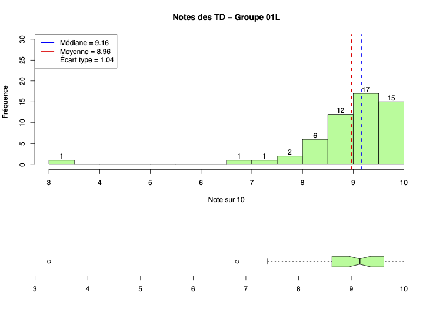
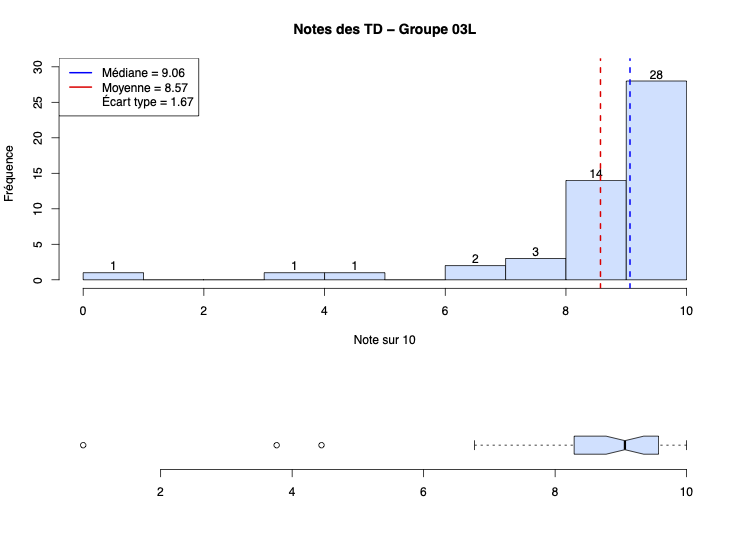
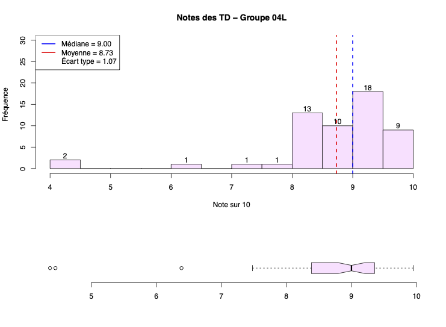

# r-weekly-grades-log1810
This side-project is designed to help my ~160 students enrolled in LOG1810 visualize their weekly grades in an engaging and visually appealing way using R.

The data is read from a CSV file, and various statistical measures such as mean, median, and standard deviation are visualized using histograms and boxplots.

## Example Outputs
### Wednesday's group weekly report

### Thursday's group weekly report

### Friday's group weekly report

